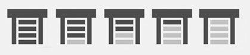

# Cover-icon-element

Improved cover icon for home assistant's picture-element which visually displays the cover's position.



### Instalation
Add this repo to `HACS` and then go to `Configuration > Lovelace Dashboard > Resources` and add a new resource:

```
URL: /hacsfiles/cover-icon-element/cover-icon-element.js
Resource Type: Javascript Module
```

### Usage

Use it as a custom element inside a `picture-elements`.
```
elements:
   - type: 'custom:cover-icon-element'
     entity: cover.my_cover
     style:
       left: 50%
       top: 50%
       width: 10%
image: /local/images/floorplan.svg
type: picture-elements
```
